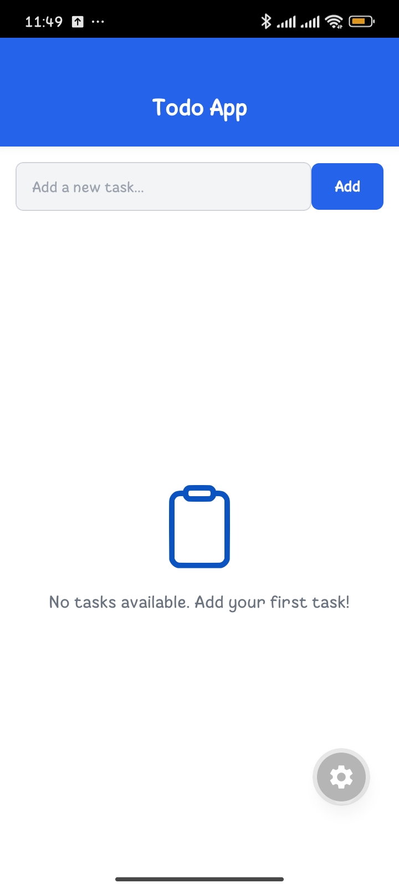
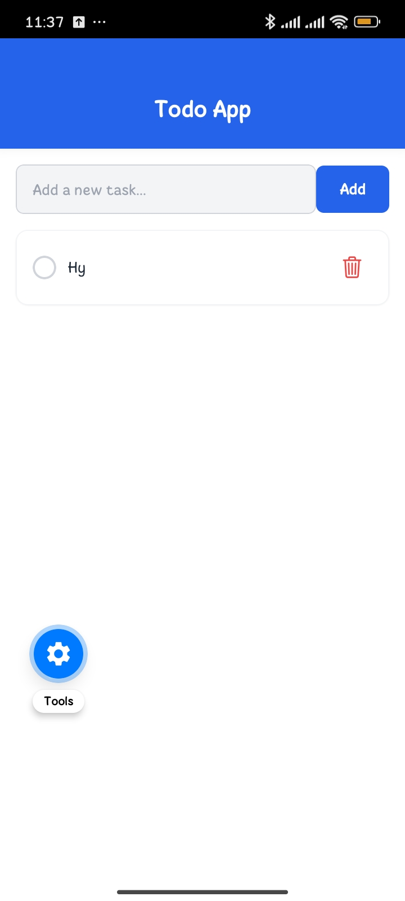

# 📝 Simple Todo App - AUREX Internship (Week 1)

 This is my submission for the **Week 1 Foundation Project** at **AUREX**. The goal of this project was to build a functional professionally structured Todo Application using React Native.

## 🚀 Features
- **Add Tasks:** Create new todo items with a clean input interface.
- **Display List:** View all tasks in a dynamic, scrollable list.
- **Mark as Completed:** Toggle task status with visual feedback (strikethrough & color change).
- **Delete Tasks:** Remove tasks instantly from the list.
- **Data Persistence:** Integrated `AsyncStorage` to ensure tasks remain saved even after the app is closed.
- **Empty State:** Friendly UI message when no tasks are available.
- **Input Validation:** Prevents empty or whitespace-only task submissions.

## 🛠️ Tech Stack
- **Framework:** React Native (Expo)
- **Styling:** NativeWind (Tailwind CSS)
- **Icons:** @expo/vector-icons (Ionicons)
- **Storage:** @react-native-async-storage/async-storage

## 📂 Project Structure
Following a scalable and professional architecture:

/src
  /components  - Reusable UI elements (Header, Input, TodoItem)
  /services    - Logic for Local Storage (AsyncStorage)
  /screens     - Main application screens (Home.js)
App.js         - Root component managing state and logic

## ⚙️ Tech Stack
- **Clone repo:** git clone [https://github.com/hamzaaa-1897/aurex-week1-todo.git]
cd aurex-week1-todo
- **Install dependencies:**  npm install
- **Run the App:**  npx expo start

## 📸 ScreenShots
|  
|  
|  |